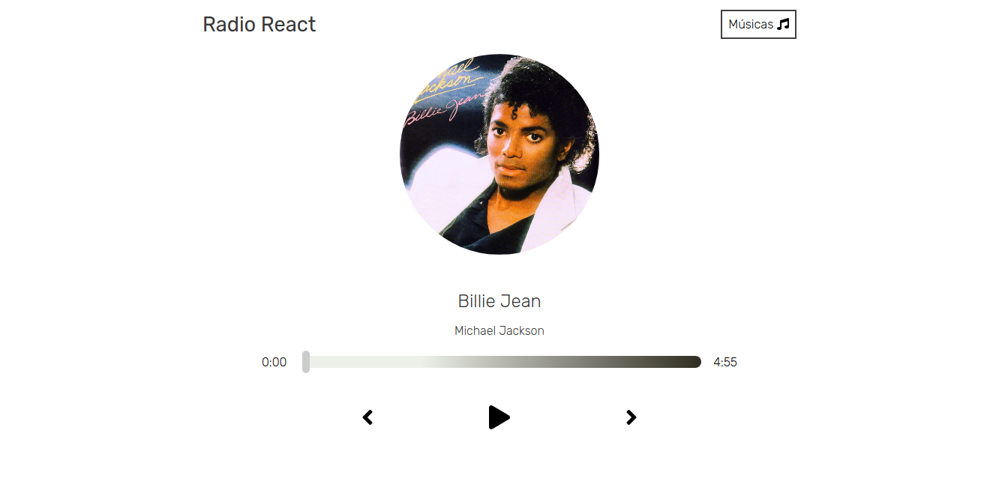
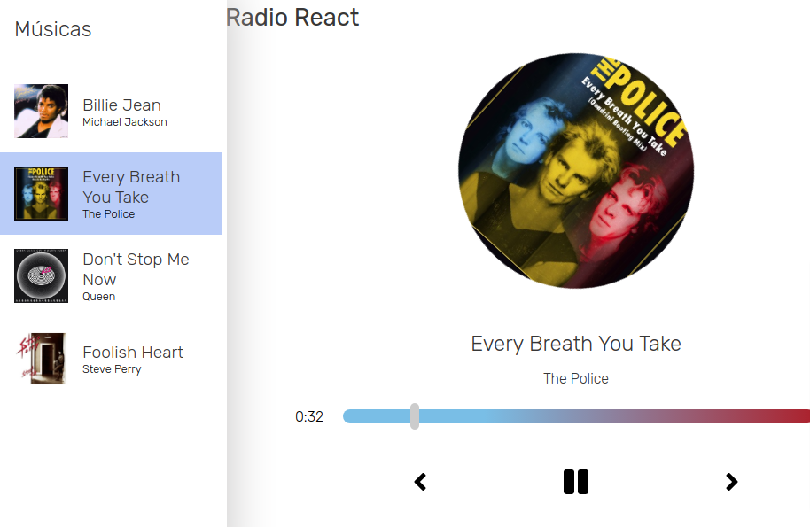

# Radio React

[Visite o site :)](https://music-player-one-rho.vercel.app/)

### Sobre

Music Player feito para aprender sobre o uso de áudio com o Javascript em si, e para disponibilização Open Source.

### Screenshots

 

### Acerca da Customização

O sistema é livre para as customizações e quem quiser adicionar em relação as músicas, basta alterar o arquivo utils.js seguindo o Schema proposto.
